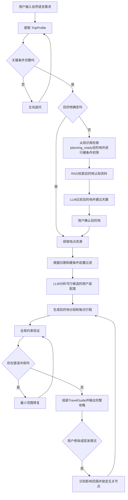
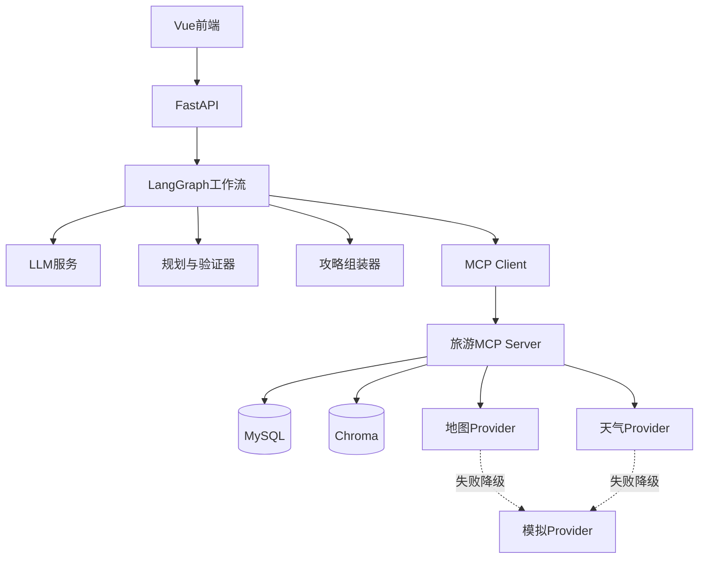

# AI旅行决策与动态行程助手：项目全局说明书

> 本文件是三位项目成员了解项目全貌的主文档。第一次接触项目时只需要先阅读这一份；需要开发细节时，再查看 `TEAM_PROJECT_PLAN.md` 和 `CONTRACTS.md`。

## 1. 项目是什么

本项目面向不经常旅游、对目的地不熟悉、希望自由行但不愿花大量时间做攻略的用户。

用户可以用自然语言提出模糊需求，例如：

> “国庆想出去玩五天，两个人，预算五千，不想太累，喜欢美食和自然风景，但还不知道去哪。”

系统通过多轮对话补全关键条件，在已有可靠数据覆盖的目的地中进行推荐，然后联合安排多个游玩地点、餐饮、具体住宿候选、地点间交通、时间和预算。计划生成前会过滤不可用地点，生成过程中持续检查，完成后再次进行全局验证，并组装为一份定制可执行旅游攻略。用户修改需求或遇到突发情况时，系统只重新规划受影响部分并生成攻略新版本。

### 一句话定位

> 一个基于LLM、LangGraph、RAG和MCP、严格受项目知识库数据边界约束的AI旅行决策与动态行程助手。

### 它不是什么

- 不是只生成一篇攻略文章的聊天机器人。
- 不是景点、酒店、天气等多个Agent的简单拼接。
- 不是全国旅游数据平台。
- 不是机票、酒店、门票交易系统。
- 不承诺现实世界中的所有信息始终准确，而是建立数据刷新、验证和降级机制。

## 2. 项目为什么有价值

普通用户规划自由行时，通常需要自己完成：

```text
搜索目的地
→ 阅读攻略
→ 判断是否适合自己
→ 查询景点开放时间
→ 比较住宿位置
→ 查餐厅和交通
→ 手工排行程
→ 发现冲突
→ 重新修改
```

用户真正缺少的不是更多信息，而是把分散信息转化为一套符合个人条件、可以执行且能继续修改的方案。

本项目把流程变成：

```text
用户表达需求
→ AI理解和追问
→ 系统获取数据
→ AI辅助决策
→ 程序规划和验证
→ 组装并输出定制可执行旅游攻略
→ 用户修改或突发重规划
```

## 3. 试点范围

为了保证三人可以完成，项目采用“小范围数据、完整业务闭环”的方式。

### 第一版支持

- 只处理知识库和事实库中数据覆盖达到 `planning_ready` 门槛的目的地，不人工维护固定支持名单。
- 省内3个左右重点目的地。
- 2～5天旅行。
- 1～4人。
- 用户不知道去哪或已经指定目的地两种入口。
- P0完整实现单目的地行程；一个目的地内部包含多个游玩区域和多个游玩地点。
- 数据结构从一开始兼容多目的地，最多两个相邻目的地的真实组合暂列P1。
- 景点、基础餐饮、住宿区域与具体住宿候选、交通、天气和预算。
- 行程验证、修改和局部重规划。

### 第一版不支持

- 全国和全球任意目的地。
- 三个以上目的地的复杂路线优化。
- 真实酒店库存、支付和下单。
- 实时客流精确人数。
- 抢票成功率预测。
- 社区、游记发布、原生移动端。

### 数据范围

试点数据可以来自一个省份、一个城市群或若干旅行区域，具体取决于数据调研结果。代码不出现硬编码目的地名单；新增数据后由KnowledgeCoverage重新计算是否允许生成完整攻略。

## 4. 用户能够完成什么

### 场景一：不知道去哪

用户提供时间、预算和模糊偏好，系统主动追问，从 `planning_ready=true` 的检索候选中给出2～3个目的地，解释适合原因、缺点、风险和建议停留天数。

### 场景二：已经确定目的地

用户直接说“去成都四天”，系统补全必要信息，推荐抵达方式和住宿，筛选多个游玩地点及基础餐饮，生成经过验证的七部分攻略。

### 场景三：想去两个地方（P1）

用户说“成都多玩几天，乐山只去一天”，系统先分配目的地天数，再规划每个地点内部行程，并加入地点间移动。

### 场景四：修改计划

用户说“第二天太累了”或“必须加入这家餐厅”，系统识别修改意图，保留无关和锁定内容，只调整受影响部分。

### 场景五：突发情况

用户起晚、遇到下雨或某景点临时不可用时，系统读取当前时间、已完成节点和不可取消预约，重新规划剩余行程。

## 5. 完整业务流程



## 6. 为什么验证不是最后才做

系统采用三层验证。

### 第一层：规划前过滤

在LLM分析地点之前，先通过结构化数据判断：

- 旅行日期是否开放。
- 是否闭馆或暂停营业。
- 是否需要预约。
- 是否明显违反预算、体力或禁止条件。
- 数据是否过期或未知。

地点状态只能是：

| 状态 | 含义 | 是否进入规划 |
|---|---|---|
| `AVAILABLE` | 当前条件下可用 | 是 |
| `CONDITIONAL` | 满足预约或确认条件后可用 | 可以，但必须警告 |
| `UNAVAILABLE` | 明确不可用 | 否 |
| `UNKNOWN` | 数据不足或冲突 | 不作为无条件主方案 |

### 第二层：规划中增量检查

每插入一个行程节点就检查：

- 上一地点结束时间加交通时间后能否按时抵达。
- 是否超过最晚入园时间。
- 当日累计活动时间和费用。
- 是否挤占用餐、休息和返程时间。

### 第三层：完成后全局验证

完整行程形成后检查：

- 总预算。
- 总天数和目的地分配。
- 每日及连续多日的体力强度。
- 住宿区域和全程通勤。
- 用户所有固定事实和硬约束。
- 天气、预约、来源和数据有效期。

验证失败的计划不能标记为已验证。

## 7. LLM怎样参与决策

本项目既不采用纯固定打分，也不允许LLM脱离数据自由推荐。

LLM不是数据源。目的地、景点、开放、价格、路线、住宿、餐饮和天气信息必须由MySQL、MCP工具或RAG证据提供；模型只对这些上下文进行需求理解、比较、决策和解释。没有证据的实体不得进入输出。

推荐顺序是：

```text
程序排除不可能项
→ RAG提供可追溯证据
→ LLM理解主观需求并比较候选
→ 程序验证LLM选择
```

### LLM负责

- 理解用户不固定、模糊的自然语言。
- 提取固定事实、硬约束和软偏好。
- 判断应该追问哪些信息。
- 比较可行目的地和景点是否适合用户。
- 根据“多玩一会”“不想太累”等表达建议天数和节奏。
- 解释推荐、排除和修复理由。

### LLM不负责

- 凭记忆判断景点是否开放。
- 自己估算真实路线和交通时间。
- 自己编造票价、库存和预约状态。
- 返回数据候选集合之外的目的地或景点ID。
- 绕过验证器直接宣布计划可执行。

## 8. 技术栈

| 层级 | 技术 | 主要作用 |
|---|---|---|
| 前端 | Vue 3 + Vite + Element Plus | 对话、候选目的地、行程时间轴、预算和修改入口 |
| 后端 | Python + FastAPI | REST接口和业务服务 |
| 数据校验 | Pydantic | 校验LLM结构化输出和模块接口 |
| 大模型 | 支持结构化输出和工具调用的LLM | 需求理解、主观决策、解释和修改意图 |
| 模型抽象 | LLMProvider | 隔离具体平台并为后续主备模型切换预留接口 |
| 工作流 | LangGraph | 多轮追问、等待用户选择、验证修复回环和重规划状态 |
| 结构化数据库 | MySQL | 事实数据、用户会话、计划和版本 |
| 向量数据库 | Chroma | 目的地认知卡片、景点知识和攻略摘要 |
| RAG | Chroma检索 + 元数据过滤 + LLM | 为推荐和解释提供可追溯知识 |
| 工具协议 | MCP | 统一暴露知识、事实、可用性、路线和天气工具 |
| 外部数据 | 地图、天气API或模拟Provider | 路线、天气和动态事实 |
| 部署 | 本地运行；可选Docker Compose | 统一启动和演示 |

## 9. 系统技术架构



### 为什么MySQL和Chroma同时存在

MySQL保存可以明确查询和计算的事实：

```text
坐标
开放时间
票价
预约规则
用户需求
计划版本
```

Chroma保存需要语义检索的文本知识：

```text
区域性格
适合和反适合人群
典型体验
攻略摘要
景点特色
```

两边通过相同的 `destination_id` 和 `resource_id` 关联。试点数据量较小时，知识变化后直接重新构建Chroma索引即可。

## 10. RAG在项目中的作用

RAG不是用来代替数据库，而是帮助LLM获得本项目资料范围内的认知证据。

RAG流程：

```text
用户需求和TripProfile
→ 构造检索问题
→ 按省份、目的地、资源类型进行元数据过滤
→ Chroma向量检索
→ 返回带evidence_id的知识片段
→ LLM基于片段比较和解释
→ 输出中保留evidence_id
```

建议知识文档包含：

```text
evidence_id
entity_id
省份
目的地
资源类型
知识内容
来源
更新时间
```

开放时间、票价等事实优先从MySQL或MCP事实工具获取，不依赖RAG文本。

## 11. MCP在项目中的作用

MCP是LangGraph访问旅游数据和外部工具的统一入口。第一版计划提供：

| MCP工具 | 作用 |
|---|---|
| `search_travel_knowledge` | 检索目的地和景点RAG资料 |
| `get_place_facts` | 获取开放时间、价格、预约等结构化事实 |
| `get_place_availability` | 判断指定日期和时间窗是否可用 |
| `get_route` | 获取两个地点之间的交通距离、时间和费用 |
| `get_weather` | 获取指定日期天气或模拟数据 |

至少前三个工具需要实际跑通；地图和天气暂时拿不到接口时，可以使用同样返回格式的模拟Provider。

## 12. LangGraph工作流

主要节点：

```text
parse_request
check_missing_fields
ask_clarification
retrieve_destinations
recommend_destinations
confirm_destinations
fetch_resources
filter_availability
build_trip_segments
build_daily_plan
validate_plan
repair_plan
assemble_travel_guide
present_plan
interpret_change
replan_affected_scope
```

LangGraph重点体现三个状态回路：

1. 信息不足：追问后回到需求解析。
2. 验证失败：修复后回到验证。
3. 用户修改或突发情况：识别影响范围后重新规划。

各节点仍然写成普通Python函数，便于单独测试。

## 13. 多目的地设计

用户可能说：

> “成都多玩几天，乐山一天就够了，如果时间够再去都江堰。”

系统把它转换为多个目的地请求：

```text
成都：高优先级，希望3天，可在2～4天之间调整
乐山：固定1天
都江堰：可选
```

规划过程分两层：

```text
第一层：分配目的地和天数
第二层：规划每个目的地内部每日行程
```

地点之间的移动作为正式 `TravelLeg`，需要占用时间和预算。第一版最多允许两个相邻目的地，避免任意多城市路线组合导致复杂度失控。

## 14. 行程生成与修复策略

第一版不追求数学意义上的最优，优先保证稳定、可解释和可验证。

基本规划方法：

```text
固定已预约和必去节点
→ 按地理区域给候选分组
→ 每天选择一个主要活动区域
→ 按开放时间插入高优先级景点
→ 插入交通、用餐、休息和缓冲时间
→ 计算预算
→ 验证
```

典型修复规则：

| 冲突 | 修复顺序 |
|---|---|
| 闭馆或不可用 | 换日期 → 换附近同类候选 → 删除并说明 |
| 时间窗冲突 | 调整顺序 → 改时间 → 换近距离候选 |
| 预算超限 | 换低价候选 → 调整可牺牲项 → 请求用户放宽预算 |
| 天气不适合 | 与室内项目换日 → 替换室内候选 |
| 强度过高 | 删除低优先级项目 → 增加休息 → 缩短跨区移动 |

修复优先保持用户已确认、已经预约和与冲突无关的节点。

## 15. 数据设计

### 数据分类

| 类型 | 示例 | 保存方式 | 更新方式 |
|---|---|---|---|
| 稳定事实 | 坐标、类型、区域 | MySQL | 人工或低频更新 |
| 半动态事实 | 开放时间、票价、预约规则 | MySQL | 定期刷新或规划时复查 |
| 认知知识 | 区域性格、适合人群、特色体验 | Chroma | 数据整理后重建索引 |
| 动态数据 | 天气、路线、临时关闭 | API/Provider | 规划或重规划时获取 |
| 预测数据 | 人流高、中、低 | MySQL规则/服务 | 按日期重新计算 |

### 关键业务对象

| 对象 | 作用 |
|---|---|
| `TripProfile` | 保存当前用户需求 |
| `DestinationRequest` | 保存用户对每个目的地的天数和优先级 |
| `DestinationRecommendation` | 保存LLM推荐理由、取舍和证据 |
| `ResourceCandidate` | 保存进入规划的景点、餐饮等候选 |
| `TripSegment` | 保存某个目的地分配到的旅行日期 |
| `PlanNode` | 保存时间轴中的活动、用餐、休息或移动 |
| `ItineraryPlan` | 保存完整行程和预算 |
| `Conflict` | 保存验证问题和修复选项 |
| `PlanState` | 保存计划版本、锁定节点和当前流程状态 |
| `DataSnapshot` | 保存本次计划使用的数据版本 |

详细JSON结构见 `CONTRACTS.md`。

### MySQL建议表

```text
destinations
places
place_opening_rules
place_prices
place_sources
lodgings
restaurants
travel_time_matrix
users_or_sessions
trip_profiles
plans
plan_versions
plan_nodes
stay_segments
travel_legs
travel_guides
guide_versions
conflicts
data_snapshots
```

第一版可以适当合并表，不必为了数据库规范过度拆分。

## 16. 数据及时性和降级

每条关键事实至少保存：

```text
value
source
collected_at
valid_until
verification_status
```

规划时先检查有效期：

- 数据有效：正常使用。
- 数据临近过期：使用但增加提醒。
- 数据过期：重新获取或标为 `UNKNOWN`。
- 多来源冲突：不作为无条件硬事实。
- 接口失败：切换模拟/缓存数据，并在结果中标明。

历史人流只输出拥挤等级，不输出伪精确人数：

```text
历史星期和小时段
+ 节假日
+ 季节
+ 天气
+ 预约情况
→ 低 / 中 / 高 / 极高
```

## 17. 前端页面

### 对话页

- 用户输入旅行请求。
- 显示主动追问。
- 显示当前已识别条件。

### 目的地候选页

- 目的地特点。
- 适合原因和不适合原因。
- 建议天数。
- 风险和资料来源。

### 攻略页

- 按 `TRAVEL_GUIDE_SPEC.md` 展示旅行总览、抵达与离开、行前准备、住宿、每日行程、预算备选和数据来源。
- 每天展示多个游玩地点、餐饮、休息和节点间交通。
- 展示总预算、未知费用、预约和警告。
- 支持锁定、删除、替换和自然语言修改，修改后展示攻略新版本。

### 突发情况入口

- 用户起晚。
- 天气变化。
- 地点不可用。
- 用户临时不想继续某项活动。

第一版地图可以先用地点列表或简单标记，不应因地图可视化影响核心闭环。

## 18. 后端接口概览

| 方法 | 接口 | 作用 |
|---|---|---|
| POST | `/api/sessions` | 创建会话 |
| POST | `/api/sessions/{id}/messages` | 输入消息并推进LangGraph |
| GET | `/api/sessions/{id}` | 获取当前计划状态 |
| GET | `/api/guides/{id}` | 获取七部分TravelGuide |
| POST | `/api/guides/{id}/confirm` | 确认攻略并锁定关键内容 |
| POST | `/api/guides/{id}/modify` | 修改攻略中的计划或条件 |
| POST | `/api/guides/{id}/incident` | 报告突发情况并重规划 |
| POST | `/api/guides/{id}/refresh` | 刷新动态数据并生成攻略新版本 |
| GET | `/api/guides/{id}/export` | P1导出Markdown或PDF |

详细输入输出格式见 `CONTRACTS.md`。

## 19. 三人分工

### 成员A：数据、RAG和MCP

- MySQL表和试点数据。
- Chroma知识库和检索。
- 资料来源、更新时间和有效期。
- MCP Server。
- 地图、天气和模拟Provider。

交付结果：根据目的地、日期和偏好返回结构化候选和证据。

### 成员B：LLM决策和Vue前端

- TripProfile提取。
- 主动追问。
- 目的地推荐和天数建议。
- 修改意图识别。
- 攻略组装器。
- Vue对话、候选和完整攻略页面。

交付结果：把用户自然语言转换成结构化需求，并将验证后的行程及其他信息组装、展示为完整TravelGuide。

### 成员C：LangGraph、规划和验证

- LangGraph状态流。
- 前置筛选。
- P0单目的地规划，以及兼容多目的地的分段结构。
- 每日排程、预算和验证。
- 修复、PlanState和局部重规划。
- FastAPI集成。

交付结果：把TripProfile和资源候选转换成经过验证的ItineraryPlan。

三条线的连接方式：

```text
B理解用户
→ A提供数据和证据
→ C规划和验证
→ B展示结果和接收修改
```

## 20. 三四天内的实现策略

### 必须真实跑通

- LLM结构化提取。
- 一次主动追问。
- 一次RAG检索并返回证据。
- 一个MCP工具被LangGraph真实调用。
- 一个单目的地内包含多个游玩地点的行程。
- 一次开放时间前置过滤。
- 一次验证失败和自动修复。
- 一次用户修改或突发重规划。
- 七部分TravelGuide的组装和Vue展示。
- Vue到FastAPI的端到端流程。

### 可以使用小规模或模拟数据

- 只准备3个目的地。
- 每个目的地8～15个景点。
- 只准备少量餐饮和住宿区域。
- 使用预设路线矩阵。
- 使用模拟天气接口。
- P1如有余力，只演示一个固定双目的地组合。

### 只需保留可解释设计

- 酒店和门票真实库存。
- 全国数据扩展。
- 任意多地点优化。
- 长期数据维护平台。
- 商业支付和预订。

## 21. 最终演示

建议准备三条固定流程。

### 演示一：模糊需求到完整攻略

用户不知道去哪，系统主动追问，RAG提供证据，LLM推荐目的地，最后生成并验证七部分攻略。

### 演示二：已确定目的地的完整攻略

用户直接确定一个目的地，系统推荐抵达方式、行前准备和住宿候选，在多个游玩区域内安排景点、餐饮、休息和本地交通，最终生成七部分攻略。

### 演示三：动态变化

用户起晚或下雨，系统锁定已完成与已预约节点，只修改剩余计划，并展示变化。

双目的地可以作为P1附加演示，不作为P0完成条件。

## 22. 主要风险和应对

| 风险 | 应对方式 |
|---|---|
| 三个人生成不同Schema | 以 `CONTRACTS.md` 为唯一标准 |
| 外部API拿不到 | 统一Provider接口并准备fake实现 |
| LLM编造事实 | 只允许选择候选ID，事实必须来自工具和证据 |
| LangGraph过于复杂 | 节点保持普通函数，只实现必要回路 |
| 规划算法来不及 | 使用地理分组、顺序插入和规则验证，不追求最优 |
| RAG只存在于演示文档 | 推荐必须输出实际检索到的evidence_id |
| MCP只写不调用 | 至少一个LangGraph节点真实调用MCP工具 |
| 功能继续膨胀 | 优先完成单目的地闭环，之后才做双目的地和人流 |

## 23. 项目怎样才算完整

项目完整不等于覆盖所有旅游业务，而是：

1. 用户可以从自然语言开始。
2. 系统能发现缺失信息并追问。
3. 推荐基于RAG证据而不是模型记忆。
4. 实际事实通过MCP工具获取。
5. LangGraph管理对话和修复回路。
6. 行程规划前、中、后都有约束检查。
7. 无解时提供替代方案，不静默突破硬约束。
8. 用户修改后能够局部重规划。
9. 数据不足或接口失败时能够降级说明。
10. 三个人负责的模块可以通过统一契约集成。

满足这些条件，即使只覆盖一个省份、三个目的地和小规模数据，也已经形成了技术与业务逻辑完整的项目。

## 24. 仍待三人共同确认

- 实际能够导入并达到planning_ready的数据范围。
- 主LLM Provider和具体模型的官方能力验证结果。
- 地图与天气API。
- 是否真的实现双目的地，还是只保留数据结构和固定演示。
- 哪一种冲突作为自动修复演示。
- 哪一种突发情况作为局部重规划演示。
- 最终是否使用Docker Compose。

确认这些内容后，应先更新本文件和 `README.md`，再让三个人的AI开始生成代码。
