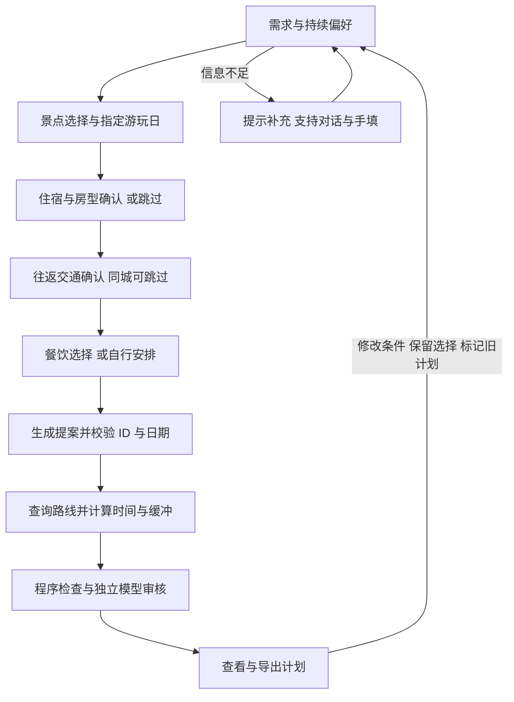
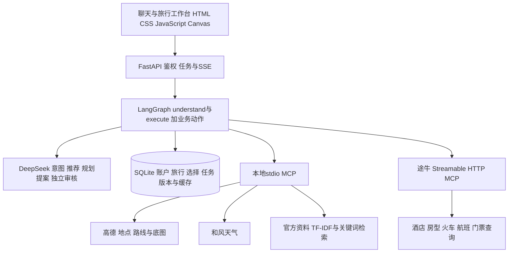
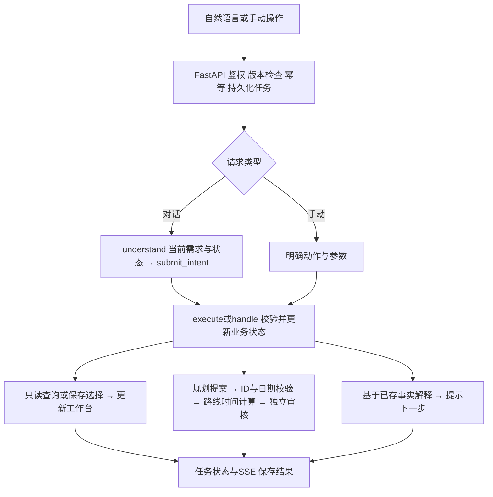

# 识途智能旅游规划 Agent

项目技术与商业化方案｜AI 应用与 Agent 开发面试资料｜v10｜2026年10月7日

项目技术与商业化方案  |  AI 应用与 Agent 开发面试资料  |  v10  |  2026年10月7日

**项目定位：**面向自由行用户及旅游服务商的交互式旅行规划产品。通过对话收集需求，结合真实地点、住宿、交通、餐饮和天气数据，支持用户比较、确认和持续调整旅行方案。当前已实现可运行原型，处于小规模体验阶段。

## 一 行业痛点与项目背景

旅行规划涉及多来源信息整合及时间、位置、预算等条件的协调。仅依赖通用大模型直接生成方案时，可能存在事实依据不足、动态信息失效和日程缺少可行性校验等风险。[1] 项目针对以下业务问题构建结构化查询与交互规划能力；实际效果需结合具体场景验证。

| 现有问题 | 业务影响 | 解决方案 |
| --- | --- | --- |
| 信息完整性与准确性不足 | 用餐、具体房型、票种及交通接驳可能缺失，未核实信息可能被表述为确定事实。 | 分模块查询结构化接口；保存来源、时间和未知项。 |
| 数据时效不足 | 历史价格、地图营业资料及远期天气信息无法直接代表出游当天状态。 | 按实际日期查询；分清快照、最低价日期与适用范围。 |
| 行程可行性校验不足 | 地点分散、通行耗时估计偏差或抵达时间过晚，可能导致当日日程无法完成。 | 结合实际路线耗时、班次与缓冲，检查顺序和冲突。 |
| 多轮交互状态保持不足 | 返程或餐饮调整可能造成住宿、偏好及已确认景点等关联状态丢失。 | 将需求、候选、确认选择与计划分开保存。 |
| 文本方案与实际操作脱节 | 用户需跨平台查询位置、比较房型与班次，并重复输入需求。 | 对话与工作台联动；卡片详情、地图和选择统一操作。 |

## 二 产品目标与服务对象

**对个人用户：**减少跨平台整理信息的操作，帮助用户完成从需求到可复核计划的过程。**对旅行服务商：**可作为售前需求整理、方案初稿和人工复核的助手；商业应用仍需验证服务效率、客户接受度及资源接入条件。

产品交付包含信息依据、日程安排、已选资源及待确认事项的旅行方案。推荐与选定状态独立于实际预订状态；未完成核验的价格、预约及规则保留待确认标识。

## 三 业务流程与状态管理

标准流程依次覆盖景点、住宿、交通、餐饮及计划生成。用户通过自然语言或手动操作调整条件，系统根据业务状态提供后续操作指引，并支持一日游、同城出游、无需住宿及自行用餐等分支。

图1 标准业务流程。关键条件尚未确认时可生成草稿，并保留未知项；信息补充及条件变更不等同于查询完成。

## 核心业务状态模型

| 状态对象 | 保存内容与作用 |
| --- | --- |
| 旅行需求 | 目的地、出发地、出游与往返日期、人数、预算、节奏、持续偏好。 |
| 候选与用户选择 | 候选目录与来源；已选景点、具体房型报价、确认班次、按日期和餐次保存的用餐意向。 |
| 计划与任务 | 计划版本及是否过期；任务进度、成功失败、中断、请求编号与工作区版本。 |

## 典型业务场景

场景条件为郑州出发、青岛三日游、海滨与海鲜偏好、轻松节奏。系统分别查询景点与餐饮，持续保存偏好；用户确认景点、住宿及往返交通后安排餐次并生成计划。返程日期后移一天时，仅更新返程条件及候选，保留景点、住宿与去程选择，同时提示核验住宿覆盖日期；现有计划标记为待更新。

## 四 技术栈与系统架构

| 层次 | 技术栈 | 承担的职责 |
| --- | --- | --- |
| 模型 | DeepSeek / deepseek-flash | Function Calling 识别动作；JSON 规划提案；SSE 流式回复和独立审核。 |
| 编排 | LangGraph | 连接 understand 与 execute 两个节点；执行内部调用业务模块。 |
| 后端 | Python / FastAPI / Pydantic / Uvicorn | 接口、输入校验、账户鉴权、异步任务、进度推送与静态资源。 |
| 工具 | MCP Python SDK / HTTPX / JSON Schema | 接入本地 stdio 和远端 Streamable HTTP；校验供应商参数，统一错误与缓存。 |
| 检索 | 本地 TF-IDF 与关键词重排 | 检索官方页面片段；保留 URL、采集时间和适用范围，当前未使用外部 Embedding。 |
| 存储 | SQLite / asyncio | 账户、工作区、任务、版本与缓存；工作区锁与请求幂等用于小规模单进程执行。 |
| 前端 | HTML / CSS / JavaScript / Canvas / SSE | 对话、推荐卡片、详情、旅行地图、选择和实时任务状态。 |
| 测试 | pytest / Playwright / Chrome | 业务与 API 检查，浏览器交互与不同屏幕布局验证。 |

依赖锁定记录：FastAPI 0.142.2、LangGraph 1.2.12、MCP 1.30.0、HTTPX 0.28.1。便携包使用 Python 3.13.9；未引入 Redis、消息队列、向量数据库或完整高德 JS SDK。

图2 系统架构。LangGraph 组织业务执行，MCP 提供工具接入协议；底层事实由供应商 API 与官方资料返回。[2][3]

模块划分：agent.py 处理意图与动作；journey.py 管理日期和流程；foods.py 处理餐次与周边；planning.py、proposals.py 负责排程与校验；providers.py、mcp_server.py 负责工具；storage.py、auth.py 管理状态与权限。

## 五 请求处理与业务执行流程

自然语言请求与手动操作统一进入业务执行模块。对话请求通过模型完成意图识别，手动请求携带确定的动作及参数，直接进入业务校验与执行流程。

图3 请求执行逻辑。不同动作分别进入查询、状态更新、规划或解释分支；任务进度与结果通过 SSE 或查询任务接口同步到前端。

## 交通查询场景与参数映射

| 执行阶段 | 实际处理内容 |
| --- | --- |
| 识别需求 | 在出发地、目的地和日期已知时，识别为去程列车查询，并提取中午时段与高铁类型。 |
| 映射条件 | 业务动作 train；direction=outbound；time_start=11:00；time_end=14:00；train_type=highspeed。明确时间以用户要求为准。 |
| 查询与展示 | 后端转换供应商查询参数，返回真实候选；右侧同步类型、方向、日期和时段，用户选定后记录为 confirmed。 |

推荐班次保存为 recommended，需经用户核对；手动或明确授权选定的班次保存为 confirmed，并维持确认状态。无票、查询条件失效或同方向替换未经确认时，由业务层拦截并提供处理指引。

## 受控业务动作的设计依据

日期变更、房型确认与计划生成具有不同的数据更新范围及调用成本，需要独立追踪。模型返回的动作意图须经过后端规则执行与持久化，方可成为有效业务记录。该设计支持异常处理、任务恢复、故障定位及回归验证。

## 六 Agent与数据工具的关键设计

## 意图识别与业务动作映射

主助手整合当前需求、可见候选、已选内容、近期对话及流程状态，并通过 submit_intent 的 Function Calling Schema 约束意图输出。模型返回 action、需求 patch、候选 ID 及筛选条件，后端完成校验与必要修正后执行业务动作。模型承担意图理解与动作选择，后端承担实际调用、状态持久化及规则执行。

系统采用受控流程编排。LangGraph 主链为 understand → execute，执行节点依据动作调用查询、选择或规划模块。推荐、规划提案、审核与公开回复分别设置上下文及输出要求；外部查询限定于只读工具白名单。

## 工具接入与供应商适配

高德与和风通过项目自建 stdio MCP 工具提供；途牛通过 Streamable HTTP MCP 接入。途牛先发现供应商真实工具 Schema，再校验参数和字段，后台只开放查询白名单。地点 ID、酒店 ID 和房型报价 ID 分开保存，跨平台名称匹配有歧义时保留待确认。MCP 负责工具协议与接入，不负责推断业务下一步。[3]

| 来源 | 实际用途 | 使用边界 |
| --- | --- | --- |
| 高德地图 | 地点、餐厅、坐标、电话、营业资料、人均、图片、路线与底图。 | 人均不是门票价格；营业资料不保证未来某日正常营业。[4] |
| 途牛 MCP | 酒店房型、往返交通、门票产品与可售快照。 | 起价不等于已确认总价；选定不代表付款、出票或预约。[5] |
| 和风天气 | 接口覆盖窗口内的预报与当前预警。 | 超出窗口的日期待确认，当前预警不是未来某日预警。 |
| 官方资料 | 景区介绍、规则片段和少量城市背景。 | 按城市与相关性检索；采集日期不代表未来适用日期。 |

## RAG 与上下文管理

本地资料采用字符二元组 TF-IDF 向量与关键词得分重排，按城市过滤后返回相关片段。该方案适用于初期小规模资料库，具有接入成本较低、来源可追溯等特点；同义表达、语义关联和城市覆盖仍存在局限。后续将依据召回失败样本评估 Embedding 与重排方案。

长期需求和已选状态保存在工作区，近期消息只作为补充上下文。媒体和道路顶点从主要模型上下文剔除，仍保留给详情与地图使用，降低无关数据对输入长度的影响。

## 七 规划可信度与工程保障

## 规划生成与约束校验机制

规划输入限定为已选地点 ID 与有效日期范围。模型生成分日顺序及建议游玩时长，程序校验候选归属、遗漏与重复、日期及指定时段的一致性。校验失败时返回具体错误并执行一次受控修订；长行程按每批最多 16 个地点分阶段生成，控制单次处理规模。

之后并行查询步行、公交和驾车路线，按偏好选择方式，将查询耗时、建议游玩与用餐时长、规划缓冲叠加成日程。程序检查时间重叠、每日结束、抵达与返程冲突；独立审核调用再检查用户要求与遗漏。审核使用同一模型、独立提示词和上下文，不能代替外部事实核验。

| 具体难点 | 已采用的方法 | 仍需核实的边界 |
| --- | --- | --- |
| 餐厅与行程脱节 | 按日期、餐次、午餐前后景点、晚间活动和住宿选参照点；已选餐厅参与路线计算。 | 缺少当天营业、菜单、订位或过敏信息时保留未知。 |
| 日期语义混淆 | 区分游玩区间、去程与返程日期，保护返程修改不覆盖旅行开始日。 | 跨城多住宿与特殊预约仍需更多约束。 |
| 门票查询混入商品 | 名称后缀重试与产品分类；保存票种、销售区间和最低价日期。 | 最低价日期和预约名额不能推导为用户当天可入园。 |
| 地图交互等待 | Canvas 先响应手势，停止后更新底图；连接复用、缓存与相同请求合并。 | 首图依赖网络；路线不保证全局最优，也不是实时导航。 |

## 安全保障与任务可靠性

账户使用 scrypt 密码哈希、服务端会话、CSRF 校验和工作区归属检查；接口密钥留在后端，房型详情移除预订凭据。任务保存用户输入与进度，支持停止、刷新恢复和重启中断标记；request_id 避免重复提交，revision 和工作区锁防止旧状态覆盖新选择。

只读供应商结果采用缓存、调用预算及查询间隔控制；手动选择和结果更新通常无需额外生成公开回复。异常处理保留已选内容，并区分无查询结果、接口调用失败及字段未提供。当前采用单进程执行，高并发部署需进一步完善任务调度与共享限流。

## 当前验证成果

115 项后端检查通过；浏览器验证覆盖详情补查、选择与滚动保留、交通筛选、门票日期、无房处理、地图手势和响应式布局。真实只读调用确认了供应商能力，隔离场景验证了界面分支。已提供启动与空白数据库核验通过的 Windows 便携体验包；这些结果不代表生产压测、商业转化或所有数据已核实。

## 八 商业价值与产品化路径

项目的潜在商业价值包括降低信息整理与方案修改的操作成本，以及整合资源比较和人工复核入口。面向旅行服务商时，可辅助咨询人员生成方案初稿并记录客户偏好与确认过程。商业收益仍需通过试用数据验证，当前尚无付费客户、转化率或效率提升的实测结论。

| 服务对象 | 可提供的价值 | 拟验证的收入路径 |
| --- | --- | --- |
| 个人自由行用户 | 完整需求收集、可信候选比较、可修改日程和行前待办。 | 基础规划免费，复杂多方案、协作与持续服务评估按次付费或会员。 |
| 旅行服务商与定制游团队 | 需求整理、方案初稿、人工复核与客户沟通记录。 | 评估按席位、使用量或服务周期收费的 B 端工具。 |
| 旅游资源合作方 | 在用户明确需求后提供相关产品查询或跳转入口。 | 取得合作与结算条件后，评估推广分成或订单佣金；目前未形成交易闭环。 |

## 产品差异化与业务资产积累

产品差异化主要体现在日期适用规则、跨平台实体匹配、异常样本、需求与选择状态、排程校验及可操作界面等业务资产。模型组件具备替换空间，业务规则与数据质量需要持续维护。产品验证应关注方案可复核性、变更后的状态一致性及查询依据与用户决策的关联；商业推荐应单独标识。

## 产品验证与运营指标

| 指标类型 | 建议记录的口径 |
| --- | --- |
| 质量 | 地点匹配正确率、字段完整率、引用支持率、条件保留率、时间冲突率；由人工样本与规则共同评估。 |
| 体验 | 首个有效结果和完整计划耗时、步骤完成率、修改后成功率、人工重新查找次数。 |
| 业务与成本 | 人工形成方案所需时间、留存、付费或有效跳转；每份完成方案的 Token 与工具调用成本。 |

单份方案成本按模型调用、供应商请求及基础设施分摊进行核算，并结合方案完成量、返工率及收入评估。鉴于旅行需求具有阶段性，会员付费意愿与 B 端采购可行性均需通过试用数据验证。

## 产品化实施路线

**质量完善阶段：**补充景区日期规则、接驳、餐饮营业及跨平台匹配，建立回归样例与人工验收机制。**服务能力拓展阶段：**完善局部行程调整、多方案及团队协作。**生产部署阶段：**配置正式域名与 HTTPS、共享数据库、任务队列、限流、监控、备份及供应商合作。客流预测与自动预订需独立验证数据、授权及产品条件。

## 九 项目陈述与关键技术论述

## 项目陈述结构

项目陈述可按照行业痛点、产品定位、业务闭环、技术方案、验证成果与能力边界展开。识途以对话和工作台承载景点、住宿、交通、餐饮、地图及计划流程；由 DeepSeek 识别业务动作，MCP 接入真实数据，工作区持久化状态，程序执行日程计算与校验，模型提供独立审核。当前原型已完成 115 项后端检查，日期规则、局部排程及正式部署仍需持续完善。

## 关键技术议题与论述要点

**Agent 架构的适用性。**旅行规划包含多轮需求补充、外部数据查询、候选确认及日程修改，需要将动作、状态和执行结果纳入业务系统。Agent 架构用于连接意图识别、工具调用与持续交互。

**Function Calling 与 MCP 的职责划分。**Function Calling 约束模型返回结构化业务动作和参数；MCP 统一工具发现、参数及调用通信。鉴权、业务校验、限流及实际执行由项目后端负责。

**LangGraph 的编排范围。**当前主图包含 understand 与 execute 两个节点，规划与审核在业务模块中受控执行。明确的流程边界有助于任务追踪与成本管理，后续可依据业务复杂度扩展节点。

**RAG 的作用与局限。**RAG 为介绍与规则提供来源依据，但仍存在召回遗漏和资料过期风险。动态价格与交通通过接口获取，程序校验及未知状态补充业务约束；该组合不构成完全消除幻觉的保证。

**路径规划策略与优化边界。**当前采用模型生成游览顺序、程序查询多种交通方式并按偏好选择及校验时间的策略。尚未实现 TSP 求解或包含预约与动态交通约束的全局优化。

**日期变更与数据失效机制。**旅行主日期与往返日期分别管理。主日期、天数或人数变化会影响酒店、房型与票务查询条件；仅调整返程时更新对应方向，保留其他选择并提示核验住宿覆盖范围。关联计划标记为待更新。

**基础设施选型依据。**当前面向小规模单进程体验，采用 SQLite 管理本地状态，采用词法检索处理小型官方资料库。生产环境将依据并发规模、任务调度及召回效果评估共享存储、队列与向量检索等组件。

**商业价值评估方法。**通过试用数据比较方案形成耗时、修改返工、任务完成率、实际采纳及单份成本。现阶段验证主要覆盖功能流程与已测分支，商业收益尚需进一步评估。

## 技术与风险参考

- [[1] NIST 生成式 AI 风险概要  幻觉风险与能力评估](https://nvlpubs.nist.gov/nistpubs/ai/NIST.AI.600-1.pdf)
- [[2] DeepSeek Chat Completions  工具参数 JSON 输出与流式接口](https://api-docs.deepseek.com/api/create-chat-completion/)
- [[3] MCP 架构说明  本地 stdio 与远端 Streamable HTTP](https://modelcontextprotocol.io/docs/learn/architecture)
- [[4] 高德 POI 2.0 文档  地点 商业与图片字段](https://developer.amap.com/api/webservice/guide/api-advanced/newpoisearch)
- [[5] 途牛酒店 MCP 文档  房型 报价 退改与库存字段](https://open.tuniu.com/mcp/docs/apidoc/mcp/hotelMCP.html)
项目实现与验证依据：requirements-lock.txt、app 各业务模块、CONTEXT.md、browser-enrichment-v10.json、browser-map-v9.json 及体验包验证记录。个人任职、团队分工与业绩需另按实际经历补充。
