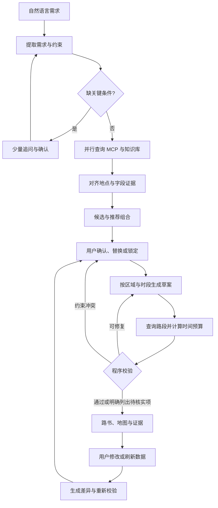

# 识途 / 旅策：项目构思与原型评审

> 历史讨论稿：用户随后明确 HTML 仅用于展示业务过程，并确认已具备途牛 MCP、高德 API、和风天气和 LLM。本稿中的原型评审与早期范围假设不作为当前实现依据。后续请以 [旅游规划项目方案](旅游规划项目方案.md) 和 [官方接口核对](官方接口核对.md) 为讨论起点。

更新：2026-10-04。状态：供讨论的建议方案，不是已确认的开发规格。

依据：用户提供的两轮讨论、v2 计划书、业务逻辑模拟.py，以及本次查阅的官方文档。
假设：个人开发，先完成可以展示并接入真实数据的 MVP；首个城市暂以原型中的青岛为例。
本次未获得 API Key，未实际验证个人账号的权限、配额、字段覆盖率或调用成本。

## 1. 原型运行结论

业务逻辑模拟.py 的内容是 HTML、CSS、JavaScript，不是 Python。已原样复制为业务逻辑模拟.html，保留原文件。

- HTML 没有外部脚本、外部样式或实际网络查询；不需要 pip/npm 安装。
- 单个内嵌 JavaScript 脚本通过 Node.js 语法检查。
- 本地 Python 标准库 HTTP 服务返回 200，Content-Type 为 text/html。
- 用最小 DOM 替身运行脚本并调用行程、总览和事件函数，复现了下表问题。这不是浏览器渲染验收。
- 浏览器自动化运行时初始化两次失败，错误为 Windows error 5。已提交 Codex 浏览器预览打开请求，工具返回 queued；尚未确认页面在 UI 中打开。

可直接用浏览器打开同目录的 HTML；当前本地服务地址为 http://127.0.0.1:8765/ ，服务结束后仍可直接打开文件。

| 问题 | 代码或运行依据 | 对真实产品的影响 |
| --- | --- | --- |
| 需求和结果未联动 | 输入 3 天、上海出发，仍得到 4 天、北京出发的行程 | 需求档案必须参与查询与校验 |
| 交通耗时写死 | 选择 1h30m 航班，行程仍写 3h48m | 时间安排必须引用所选交通记录 |
| 总览出现 NaN | food/spots 保存字符串 ID，总览却读取 ID 的 price | 前端通过 ID 查实体，金额使用统一预算模型 |
| 天气调整只交换对象 | Day 2 / Day 3 名称改变，sub 内日期未改变 | 日期、路线、开放时间需一起重新校验 |
| 餐厅调整未反映到行程 | applyAlert(e3) 修改选择列表，没有修改已有 itinerary | 接受变更后需要生成新方案版本 |
| 事件可能与选择无关 | 默认不选崂山、去程为 G1061，仍展示崂山/G207 的事件 | 事件必须绑定当前方案的地点、交通与日期 |
| 时间轴与覆盖不完整 | 午餐可能在下午景点后追加；部分区域被多天重复采用 | 验收时间顺序、重复安排与用户选择覆盖 |
| 来源和等级是写死的 | DATA 内固定价格、天气、查询时间、A/B 标签 | 演示环境应明确显示“模拟数据”，不能算作核验 |

以上问题先作为评审记录，尚未修改原型业务逻辑。

## 2. 建议定位和第一版边界

定位：面向低频旅行用户的协作式旅行规划助手，提供有数据依据的建议、可执行的时间安排和可追溯的修改。

可信的承诺应是“已查询的信息能追溯，推断和未知信息能分辨”，而不是“每个数字绝对正确”。路线 API 给出的是查询条件下的预计时间；未来真实通行时间仍有变化。

第一版聚焦一个城市、2–5 日、市内自由行。支持同行人数、日期、预算范围、节奏、兴趣、必去/不去地点，以及用户给定的抵达/离开时间、住宿位置。

第一版完成：需求对话、真实 POI、路线查询、天气、带证据的景点介绍、逐日行程、地图、自然语言修改、版本对比、临行前手动刷新。

第一版的住宿和美食可以做区域/地点推荐；缺少实时报价时，显示规划预算或待确认价格。跨城交通允许用户输入已选班次和到达时间，并提供外部核实入口。火车余票、航班报价、酒店库存、社区运营和持续推送后置。

如果有某项数据实际可用，可提前接入；上述边界是优先顺序，不是永久删掉能力。

## 3. 在个人条件下组织数据

| 数据 | 第一版获取方式 | 必须区分的含义 | 缺失时行为 |
| --- | --- | --- | --- |
| POI 名称、地址、坐标、ID | 优先验证高德个人 Key / 官方 MCP | 地点存在不等于当前开放 | 保留待核实候选，不进入已核验路线 |
| 市内路线 | 地图路径规划 | 距离、预计耗时、交通模式、查询条件 | 对受影响路段标待核验，不能交付为完整可行行程 |
| 温度、降水、风、预警 | 优先验证和风；高德天气可作基础候选 | 发布时间、查询时间、预报有效日期 | 超出预报范围展示“尚未覆盖”，提供条件备选 |
| 门票、预约、开放时间 | 官方景区/博物馆页面人工整理并核查 | 适用日期、票种、优惠、预约规则 | 不写确定票价，不把缺失金额记为免费 |
| 住宿 | POI + 住宿区域资料 + 用户选定酒店 | 地点与人均参考消费不是入住日期报价 | 预算区间或用户录入，库存未知 |
| 美食 | POI + 少量人工整理特色资料 | 参考人均不是某一顿真实账单 | 展示地点/菜系建议，不虚构评分、评论 |
| 体力与雨天适配 | 小规模人工标注；必要时模型辅助提取 | 人工观察、来源描述和模型推断 | 标注“信息不足”，避免确定承诺 |
| 班次、价格、余票 | 第一版用户输入 + 外部核实入口 | 用户提供不等于系统验证 | 未接入时不能声称持续监控余票 |

### 3.1 本次核对的官方能力与边界

高德 POI 2.0 文档包含基础地点字段，并列出可选营业时间、评分、cost 等商业字段。cost 的语义是人均消费，不是门票产品报价或酒店实时房价；字段可能不返回。M1 验收应先要求 ID、位置、地址可用，不能把“必有票价”作为地图库的基础保证。[官方 POI 文档](https://developer.amap.com/api/webservice/guide/api-advanced/newpoisearch)

高德有官方 MCP，涵盖地点搜索、详情、路径规划和天气。官方能力存在不代表用户的 Key 已获得所需权限，也不代表社区同名 Server 就是官方。[官方 MCP 文档](https://developer.amap.com/api/mcp-server/summary)

和风当前天气和基础服务定价页面列出每月前 50,000 次请求单价为 0；应结合账号实际配置核验，而不是沿用旧版“每天 1,000 次”的说法。当前每日预报文档最多支持 10 天，并提供降水量和概率等字段。[当前定价](https://dev.qweather.com/docs/finance/pricing/)、[每日天气接口](https://dev.qweather.com/docs/api/weather/weather-daily-forecast/)

原型在 10 月 3 日给出 10 月 15–18 日的精确预报，不能原样迁移到真实查询。适配器应检查接口实际覆盖日期。高德基础天气文档也没有列出降水概率和官方预警，不能直接当作完整天气能力的等价替代。[高德天气接口](https://developer.amap.com/api/webservice/guide/api/weatherinfo)

### 3.2 每个数据源的接入验收表

在写完整业务后端前，对候选接口填写：

1. 个人账号是否能注册、开通，具体 Key 类型和授权方式是什么。
2. 正常成功、无结果、参数错误、限流、超时的响应是什么。
3. 需要的字段实际返回多少；抽查不同类型地点，而非只看一个示例。
4. 价格/时间/状态字段分别代表什么；有没有供应商发布或更新时间。
5. 预报窗口、班次可查询日期、报价有效期是什么。
6. 控制台当前配额、QPS、计费和数据展示/缓存要求是什么。
7. 一次规划需要多少次查询；修改一次会追加多少。
8. 若不可用，替代供应商、用户录入和未知状态如何呈现。

结果记录为“可接入 / 部分可接入 / 未验证 / 暂不可用”，不能仅凭 SDK 或 MCP 工具名判定可用。

## 4. Agent、RAG、MCP 的具体分工

### Agent：理解和协作规划

建议从一个主 Agent 和几个工作流节点开始。主 Agent 理解自然语言、提取需求、发现缺项、决定查哪些工具、选择已有候选、解释取舍和处理修改。

单独的景点/酒店/美食/交通模块不必都调用 LLM。字段适配、预算加总、日期处理、白名单检查、路线时长校验由程序执行。后续复杂检索或多人协作需要时再拆成专业 Agent。

建议 LangGraph 编排状态，保存检查点，在候选确认或重大变更时暂停并恢复。其 interrupt/checkpointer 是现成的实现机制。[LangGraph 官方文档](https://docs.langchain.com/oss/python/langgraph/interrupts)

### RAG：让推荐理由有资料依据

先做一个城市的小规模知识库，建议 20–30 个常见地点，辅以区域和主题资料。以下数量只是起步目标，未采集。

- 官方资料：开放规则、参观须知、预约方式、可访问设施；变化较快的内容另做结构化事实。
- 编辑资料：区域特点、建议游玩时长、适合的兴趣、室内备选；注明整理来源及审核时间。
- 用户资料：已订酒店、到达时间、必须参加的活动；保存为旅行状态，不混入公共知识库。

每段元数据至少包括 source_id、source_url、city/adcode、entity_id、topic、published_at（未知可空）、fetched_at、reviewed_at、valid_from/valid_to、source_type、content_hash。

检索顺序：城市/实体过滤 → BM25 + 向量召回 → 去重与有效期过滤 → 轻量重排 → 返回片段和引用。先验证召回与引用质量，再考虑额外 reranker。

查询时间不代表内容更新时间；刚下载的旧攻略仍是旧攻略。新鲜度规则按字段配置，不能用一套 30/90 天权重代替所有有效性判断。营业时间过期就不能因文本相关性高而当作当前事实。

示例：用户说“带爸妈、少走路”，RAG 返回有来源的坡度/台阶/设施/建议时长信息，Agent 用它解释候选；路线 API 提供景点之间的步行距离。景区内部步行量与坡度可能仍未知，不能把景点间距离当成全程步行量。

### MCP：接入已授权的数据和检索工具

必须保留 MCP，但不必等待 OTA 提供企业服务。自己的资料库和已有 HTTP API 都可以封装成 MCP 工具。

建议两组逻辑工具：

- 地点与天气：search_places、get_place、get_route、get_weather、get_weather_alerts（有数据时）。
- 旅行知识：search_travel_knowledge、get_place_rules、get_evidence。

第一版可由一个自建服务分组提供，或连接高德官方 MCP 加一个知识 MCP。供应商适配层负责标准化字段、错误、时间与来源。MCP 本身不会自动把高德/百度字段统一成同一个业务模型。

工具返回结构化结果，包括 status、data、evidence_ids、fetched_at、source_updated_at、valid_for、missing_fields、cache_status、warnings。只有有效数据才进入规划。工具输入/输出有 Schema，不能只返回一段自然语言让模型重新猜字段。[MCP Python SDK 结构化结果](https://py.sdk.modelcontextprotocol.io/advanced/low-level-server/)

普通 HTTP 函数是工具内部实现，MCP 是 Agent 侧接口，二者可同时存在。

## 5. 推荐工作流与交互改进

保留原型的对话区、需求档案、候选卡片、行程和变化提示。改进方向：

1. 先解析完整自然语言，只追问缺失条件；提供快捷选项和自由输入，不固定问六次。
2. 日期、人数、预算口径必须明确。预算是全团/每人、是否含往返、几间房/几晚，都参与计算。
3. 给出默认推荐组合，用户可一键接受；允许标记必去、可替换、不感兴趣。
4. 酒店和到达时间通常影响所有天，需重点确认；不要求逐张餐厅卡片都选完才生成。
5. 把跨城交通与市内交通区分。市内路线属于核心，票务缺失时仍能规划城市内行程。
6. 每天展示实际日期、活动时段、地点之间的交通段、休息缓冲、预约提醒、预算口径和未知项。
7. 用户说“第二天轻松些”，只调整相关日程；锁定项保持，若无法满足则解释冲突。
8. 修改先显示新增/删除/时长/预算变化，再由用户应用；保留上一版和撤销入口。
9. 第一版提供“刷新天气和关键数据”按钮，附上次检查时间。后台定时检查后置。

## 6. 可信机制：字段级证据和程序校验

### 6.1 证据不等于卡片装饰

建议在 A/B/C/D 之外，单独保存信息性质：事实、供应商预估、模型推断、规划建议、用户输入、演示。

| 信息 | 推荐展示 |
| --- | --- |
| 查询到的地点坐标 | 已查询：地图源，查询时间 |
| 路线 API 返回 18 分钟 | 查询时预计 18 分钟：交通方式与时间 |
| 建议游览 90 分钟 | 建议时长：参考资料，允许用户调整 |
| 无酒店实时报价 | 住宿预算区间；实际房价待核实 |
| 未查到票价 | 票价待核实，附官方入口，不记为 0 元 |
| 用户给定抵达时间 | 用户提供，尚未由系统验证 |
| 纯演示返回 | 模拟数据；不能显示为真实 A/B 证据 |

A 可表示某字段有直接工具/官方证据，但必须匹配字段语义和适用日期。两份资料只有支持同一条断言、且来源独立，才能作为 B。模型不得自行提升证据等级。

Evidence 记录建议：claim_id、entity_id、field、value、unit、source_id、source_url/tool_name、fetched_at、source_updated_at、valid_for、grade、nature、snapshot_ref、verification_status。

保留允许保存的查询依据与脱敏调用记录；API Key 不进入前端、模型提示、日志或证据卡。

### 6.2 地点约束

先查真实候选，模型只选择候选 ID。服务器检查候选集合、城市、类型、重复和用户排除项，再从已取回数据回填。必要时才补详情查询，避免无条件重复消耗配额。

最终地点名、坐标和事实数值由服务端填入结构化结果。模型的推荐说明仍可能产生无依据陈述，因此描述也须关联证据；ID 校验不能消除全部幻觉。

大型景区优先使用入口/导航点而非中心坐标，坐标记录供应商与坐标系。

### 6.3 行程校验

- 时间：实际日期、抵达/离开边界、活动结束 + 通行 + 缓冲 ≤ 下个开始。
- 地点：城市正确、用户必去覆盖、没有无意重复、入口合理。
- 开放：营业日、闭馆日、最晚入场和预约时段；未知则提示，不能声称已确认。
- 体力：景点间步行量与景区内部预计步行量分别记录；未知不等于零。
- 预算：票种人数、房间数晚数、餐饮口径、已知金额与估算区间分别加总；未知成本单独列出。
- 证据：数值与工具返回/资料一致，日期覆盖正确，无来源冲突被静默掩盖。

先按区域分组并筛候选，再查询实际使用路段。候选很多时，避免为全部地点做 n² 路线调用。优化目标包括兴趣、开放时段、少步行、预算和缓冲；简单 TSP 只解决距离排序的一部分问题。

结果状态：可行、部分待核实、约束冲突。路径未核验、时间冲突等关键问题不得标成“完整校验通过”。价格缺失等非阻断问题可以附清单交付草案。

### 6.4 刷新和变更

只检查当前行程涉及的地点、日期和交通。供应商查询失败不是“景点关闭”；数据缺失不是“餐厅歇业”。有真实新证据才能创建状态变化事件。

事件包含 source/evidence、affected_items、observed_at、建议变更、预估影响、base_plan_version。应用前确认基准版本仍一致，应用后重新核算日期、路线、预算和证据。

优先实现天气刷新。余票、餐厅营业、临时施工等能力必须在来源支持并实际测试后再声称可监控。用事件模拟器验收流程时，全程标为演示模式。

## 7. 技术建议与最小数据模型

推荐起点：Python + FastAPI + LangGraph + Pydantic；MCP 使用官方 SDK 的 FastMCP 能力或经兼容性验证的独立 FastMCP；前端 Vue 3 + TypeScript + Vite；开发期 SQLite 保存业务状态、Chroma 保存向量。

这是适合个人起步的建议。模型选用你能稳定调用且通过结构化输出/工具调用测试的 DeepSeek 或 Qwen；Embedding 单独选择中文检索效果合适的模型，不必与聊天模型同品牌。

后续多人部署再考虑 PostgreSQL + pgvector 和 Redis。业务存储、向量存储、LangGraph 检查点是不同职责，即使采用同一个数据库，也应分别设计。

前端负责输入、交互状态和展示；后端负责持久化、工具查询、规划、校验与版本。可用 SSE 展示实际进度：提取需求、检索、查路线、校验、等待确认。进度来自执行状态，不生成虚假的“查询成功”。

核心对象：TripRequest、Place、Evidence、KnowledgeChunk、RouteLeg、ItineraryItem、PlanVersion、BudgetSummary、ChangeProposal、ProviderCapability。

缓存按供应商限制与字段变化速度配置：地点身份与动态状态分开，天气保留发布时间和有效期，路线缓存包含起终点/模式/出发条件。TTL 到期或接近出行时刷新，供应商失败时标记陈旧；不建议所有 API 一律无缓存。

## 8. 建议开发顺序与验收

| 阶段 | 产出 | 验收重点 |
| --- | --- | --- |
| P0 数据验证 | 候选接口能力表、样例响应和缺失字段统计 | 个人 Key 实测地点/路线/天气；不接得上则明确替代方案 |
| P1 可信数据底座 | 统一 Place/Evidence/Route 数据、自建 MCP | 不丢来源；无效 ID 和供应商错误有清晰结果 |
| P2 一城市 RAG | 有来源的小知识库、混合检索与引用 | 城市隔离、过期内容处理、未知问题不硬答 |
| P3 最小 Agent 闭环 | 需求 → 候选 → 时间安排 → 校验 → 草案 | 天数/日期/人数生效，真实候选，路线可追溯 |
| P4 前端与修改 | 对话、地图、卡片、锁定、版本差异 | 改某日后相邻路线预算同步更新，可撤销 |
| P5 天气刷新 | 新数据 → 影响分析 → 调整建议 → 用户确认 | 日期/版本一致；模拟与真实来源分明 |
| P6 扩展 | 更多城市、票务/酒店供应商、后台监控 | 单独验证数据权限、配额与实际质量 |

前端联调从 P3 起穿插进行，不等所有供应商接完才接页面。

## 9. 评估项目的实际价值

先准备 20–30 个有明确约束的测试需求，包括老人少步行、雨天备选、周一闭馆、晚到早走、预算不含往返、用户锁定景点、路线服务失败、资料冲突和超预报窗口。

程序指标：候选外实体数量、字段证据覆盖率、关键未知项显式披露率、时间冲突数、必去覆盖率、预算算术一致性、错误降级正确性、局部修改影响范围、调用次数/Token/耗时。

这些指标不能替代真实准确率。抽查官方规则和 API 结果的语义、日期、字段是否被正确使用；对独立测试需求人工核验。

对同一组需求比较：仅 LLM、LLM + RAG、LLM + RAG + MCP + 程序校验。使用相同约束与数据快照，记录事实错误、可行性和人工修改成本，避免使用未核实的“50%/92%”作为项目效果。

需要真实使用者验证的产品问题：默认方案能否减少选择负担；用户能否理解待核实项；修改是否容易；相较自己搜攻略实际节省多少时间。

## 10. 仍待讨论的事项

- 项目主要用途：作品集/毕业设计、学习，还是公开服务。
- 首个城市是否采用青岛，以及优先老人出游还是普通自由行。
- 用户当前已有的地图/天气 Key、账号类型、模型接口和可接受调用预算。
- 前端 Vue/React 的熟悉程度。
- 知识库由谁整理和维护；第一版能投入多少人工核查。

这些信息会调整范围、实施顺序和技术细节。现阶段不需要同时确定所有 OTA 供应商，先验证核心数据并完成可校验的规划闭环。
